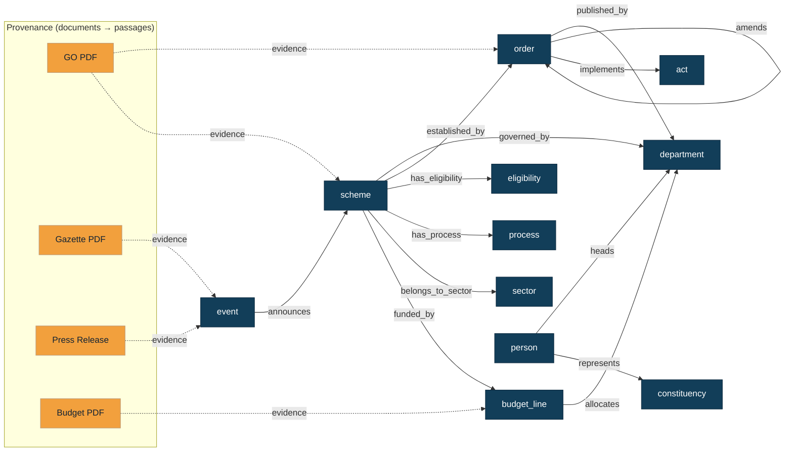

# WikiGov Graph Model

How the eight TN sources become one connected, versioned, source-verifiable graph.
Two layers, kept separate on purpose:

- **Provenance layer** (documents): the raw, immutable evidence — GOs, Acts, gazette
  notifications, press releases, budget PDFs — stored as `documents → document_versions
  → passages`. Full text lives here; every claim cites a passage here.
- **Concept layer** (nodes): the durable, versioned meaning citizens ask about —
  schemes, departments, eligibility, processes, events, people. Stored as `nodes →
  node_versions → node_aliases`, connected by `edges`, each edge justified by a
  passage via `edge_evidence`.

Supersession is handled by **versioning** (`node_versions.valid_to`,
`document_versions.valid_to`), never by overwriting.

## Concept node types (`nodes.type`)

| type | Represents | Primary source |
|---|---|---|
| `department` | A TN government department (accountable publisher) | 4, 2, 3 |
| `scheme` | A government scheme / benefit | 3 (+2 for evidence) |
| `eligibility` | A reusable eligibility criterion (income cap, residency, age) | 2, 3 |
| `process` | An application / procedural step | 2, 3, 7 |
| `event` | A dated occurrence (launch, appointment, review, session) | 5, 6, 7 |
| `person` | An office holder (minister, MLA, officer) | 6, 4 |
| `constituency` | An electoral constituency | 6 |
| `sector` | A theme/sector for browse + aliasing (Social Welfare, Agriculture) | 3 |
| `order` | A Government Order as a graph anchor (for lineage) | 2 |
| `act` | An Act / Bill as a graph anchor | 6 |
| `budget_line` | A budget allocation | 8 |
| `dataset` | A statistical dataset | data.gov.in |

## Edge types (`edges.relationship_type`) — each carries evidence

| edge | From → To | Meaning |
|---|---|---|
| `governed_by` | scheme → department | who owns/administers the scheme |
| `published_by` | order / event → department | who issued the artifact |
| `established_by` | scheme → order | the GO that created/defines the scheme |
| `amends` | order → order | a GO amends an earlier GO |
| `supersedes` | order → order | a GO replaces an earlier GO |
| `implements` | order → act | GO implements a statutory Act |
| `has_eligibility` | scheme → eligibility | eligibility rule for the scheme |
| `requires_document` | scheme → document | document a citizen must submit |
| `has_process` | scheme → process | how to apply |
| `funded_by` / `allocates` | scheme → budget_line / budget_line → dept | fiscal linkage |
| `announces` | event → scheme / order / department | press/announcement signal |
| `represents` | person → constituency | electoral representation |
| `heads` | person → department | minister/secretary of a department |
| `belongs_to_sector` | scheme → sector | thematic grouping |

## The shape

## Reading the graph (example)

> "What is the Kalaignar Magalir Urimai Thittam and who runs it?"

`scheme(Magalir Urimai)` —`governed_by`→ `department(Social Welfare)`; the scheme's
`established_by` edge points to `order(G.O. 118)`, whose passages (page 2:
eligibility, page 3: documents) are the cited evidence. A later `event` from a
press release may `announce` a revision, and a `budget_line` `funds` it. The
answer surfaces the scheme's approved node version and cites the GO passages.

## Ingestion → graph mapping (per source)

| Source | Emits nodes | Emits edges | Evidence passages from |
|---|---|---|---|
| GO list | order, scheme, eligibility, process | established_by, governed_by, has_eligibility, amends | GO PDF (OCR) |
| Schemes | scheme, sector, eligibility, process | governed_by, belongs_to_sector, has_process | scheme HTML |
| Departments | department, person | heads | dept HTML |
| Press | event | announces, published_by | press PDF/image (OCR) |
| Assembly | act, person, constituency, event | implements, represents | assembly PDF/HTML |
| Gazette | event, process | published_by, supersedes | gazette PDF (OCR) |
| Finance | budget_line, dataset | funded_by, allocates | budget PDF |
